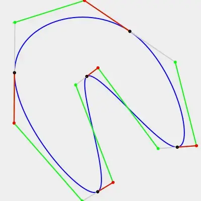
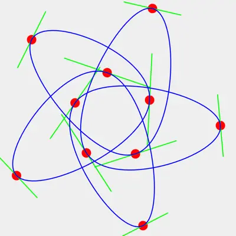
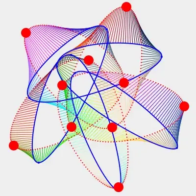

## Work-In-Progress

# ccbc

Closed Continuous Bézier Curves (remastered)

### Welcome to the Wonderful World of user friendly Bézier Curves.

This repo is a mess because it is preliminary.
Collecting and constructing materials, documentation and samples.

A continuous Bézier curve is a composite curve (multiple consecutive smaller curves) that at the seams share an identical first and second derivatives.
The general issue is that implementations consider it "open", meaning that the sections of the curves are independent/non-connected.
Control points are mostly machine generated and far from intuitive.
Attempts to manually change the curve usually ends in distorting the whole.

This project takes a new approach to Bézier curves considering all sections connected (closed curve).
Maths drastically simplify, creating B/C control points for plotting is a linear function (instead of matrix solving).
Intuitive human/curve interaction, control points are no longer off-curve but are actually located on the curve.
Ultra high speed plotting allows for real-time fitting of curves onto contours (represented as a vector of coordinates).

Samples: (Click image to open interactive version)

## Basic Bézier with on-curve control points

[](animated.html)

## Remastered curve with 10 control points

[](remastered.html)

## Compare between Bézier curve and coordinate vector

[](compare.html)

## Bézier curve with dynamic number of composite sections

Left in "visual" mode, right in "precise" mode.

[](resize.html)

## Requirements

*   mootools for DOM/javascript connectivity (included)

## Source code

Grab one of the tarballs at [https://github.com/xyzzy/smile/releases](https://github.com/RockingShip/ccbc/releases) or checkout the latest code:

```sh
  git clone https://github.com/xyzzy/smile.git
```

## Versioning

Using [SemVer](http://semver.org/) for versioning. For the versions available, see the [tags on this repository](https://github.com/RockingShip/ccbc/tags).

## License

This project is licensed under the GNU Affero General Public License v3 - see the [LICENSE.txt](LICENSE.txt) file for details

## Acknowledgments

* Pierre Bézier and his amazing work on what is now known as Bézier curves.
